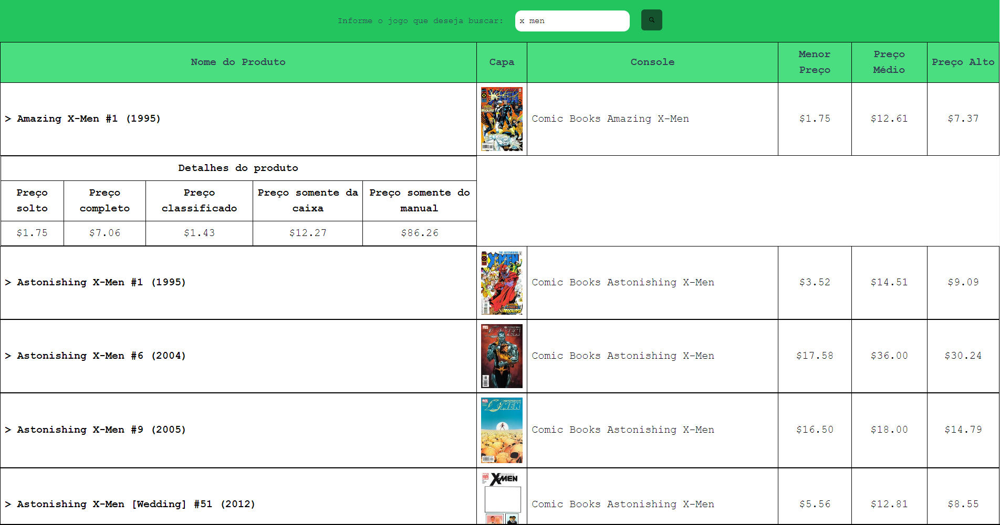

# NuxtJS > price-charting

### Descrição 

- Este projeto é desenvolvido usando o framework Nuxt.js, uma estrutura baseada em Vue.js que facilita a construção de aplicações universais. O objetivo principal do projeto é permitir que os usuários pesquisem e visualizem detalhes de produtos específicos. A interface apresenta uma tabela que lista produtos com informações básicas. Ao selecionar um produto, os usuários podem ver detalhes adicionais sobre ele em uma tabela separada.

### Funcionalidades

- Pesquisa de Produtos: Os usuários podem inserir um termo de pesquisa, e o sistema buscará produtos relevantes.

- Visualização de Detalhes do Produto: Ao clicar em um produto na tabela de listagem, os detalhes desse produto são exibidos em uma tabela de detalhes separada.

### Tecnologias e Ferramentas

- TailwindCSS

- Nuxt.JS: O projeto foi construído com o Nuxt.JS que é um framework baseado em Vue.JS.

- Axios: No projeto, é usada para obter informações de produtos através de web scraping. 
